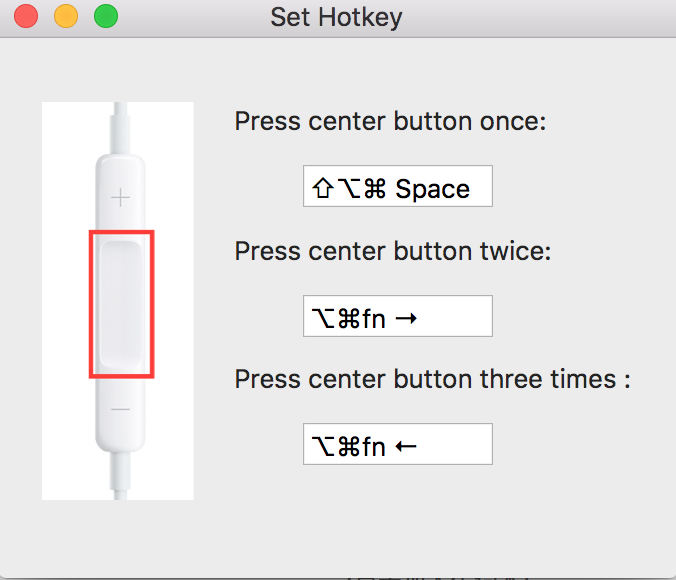

# MikeyPlay

simulate hotkey(keyboard shortcuts) with Apple-compatible Headphones in Mac OS X

 

   

## Screenshots

## Features

1. simulate hotkey(keyboard shortcuts) with Apple-compatible Headphones
2. stop itunes from opening automatically(use "ps -ef | grep iTunes | grep -v grep | awk '{print $2}' | xargs kill")

## Download

Download the Mac Desktop Application at [Mac App Releases](https://github.com/wmttom/MikeyPlay/releases)

## Contributing

Feel free to create PR, issues, and fork the repo.

## License

MikeyPlay is released under the [MIT License](http://www.opensource.org/licenses/MIT)
